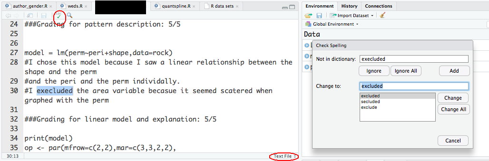

1. it's better to use *accessor methods*, i.e. `coef()` rather than `[["coefficients"]]]` or `$coefficients`, whenever possible
2. always best to use names in original data set (shorten them by renaming up-front if necessary); rather than

```
a <- dd$x
b <- dd$y
c <- dd$z
lm(c~b+a)
```

do

```
lm(z~y+x, data=dd)
```

Always try to keep variable names meaningful (but also short enough for convenience)

3. always start a clean R session when working on your code.  Before submitting, make sure it all runs by clicking on the "Source" button. Do **not** start your code with `rm(list=ls())` ! See [here](https://twitter.com/hadleywickham/status/940021008764846080)

4. It's fine to use functions from other packages, but you must indicate where they come from! It's helpful to include all of your `library()` specifications at the top of your R script (not in the middle where they are first used), so users can see that they will need to install them. Please do *not* include `install.packages()` commands in your R script (unless they're commented out)

5. You can spell-check an Rmarkdown file easily in RStudio; if you are submitting homework as an R file with embedded comments, you can temporarily tell RStudio to treat your file as a text file (click on the file type indicator at the bottom right of the script window and select `Text file`; click on the spell-check "ABC" icon (you'll have to "ignore" a certain number of R commands, variable names, etc.); click on the file type indicator to switch the type back to R script).


