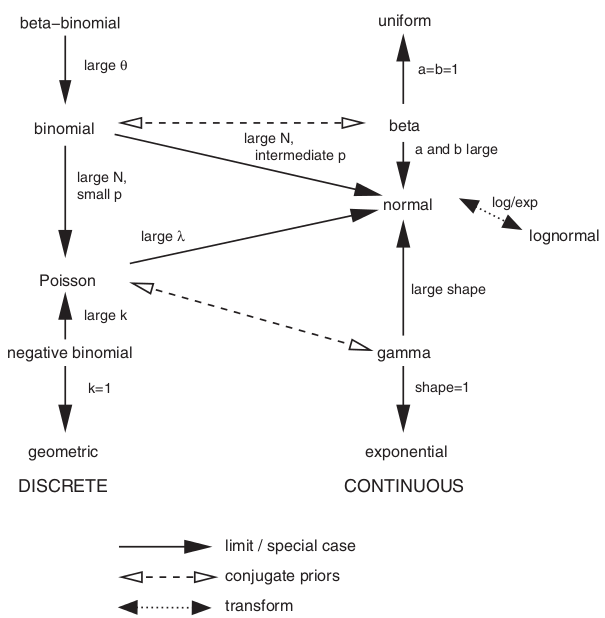

<!--
\usepackage[footnotesize,bf]{caption}
%\usepackage[chicago]{natbib}
%% improve figure caption typsetting:  (see ~/tex/caption.pdf for manual)
\newcommand{\code}[1]{{\tt #1}}
\title{STAT 4/6C03: notes, week 2 (part 1)}
\author{Ben Bolker}
\newcommand{\medsize}{\fontsize{8}{10}\selectfont}

-->


```{r opts,echo=FALSE,message=FALSE}
library(knitr)
opts_chunk$set(tidy=FALSE,fig.width=6,fig.height=4,fig.position="center",
               dev="tikz")
knit_hooks$set(basefig=function(before, options, envir) {
                   if (before) {
                       par(bty="l",las=1)
                   } else { }
               })
library(ggplot2)
theme_set(theme_bw()) 
``` 

# Notation

I will try to follow the following notation:

- *scalars, estimates*: lower-case roman: $a$, $b$
- *vectors*: lowercase bold math Roman: $\bm y$
- *matrices*: bold math Roman: $\bm X$
- *random variables*: upper-case Roman: $Y$
- *estimates* (alternative): "hat": $\hat \beta$
- *model parameters* lower-case Greek: $\beta$ (scalar), $\bm \beta$
(vector), $\beta_i$ (vector element)

Probability distributions will be written out as proper, Roman names, possibly 
abbreviated: Normal, Beta, NegBinom, Gamma (the Gamma *function*
is also spoken "Gamma", but is written as $\Gamma(x)$)

The symbol $\sim$ means ``distributed as'': $Y \sim \text{Normal}(\mu,\sigma^2)$


# Distributions

## Related to the Normal distribution

These are mostly used *not* used to describe data, but rather as theoretical constructs (e.g. null distributions, Bayesian priors). *Non-central* variants are mostly used for power analyses.

\newcommand{\y}{{\bm y}}
\newcommand{\V}{{\bm V}}
\newcommand{\A}{{\bm A}}
\newcommand{\bb}{{\bm \beta}}
\newcommand{\X}{\bm X}

- Normal: standard ($Z$: $\mu=0$, $\sigma=1$), non-standard, MVN: closed under convolution (addition of random variables)
- $\chi^2$: central, non-central: also closed. Central: mean $n$, var $2n$. Non-central;
  mean $n+\lambda$, var $2n + 4 \lambda$, where $\lambda = \sum \mu_i^2$.
- MVN has ${\y}^T {\V}^{-1} {\y} \sim \chi^2_k$
- (Wishart distribution $W(\V,n)$: distribution of $\sum_{i=1}^N \y_i \y_i^T$ where the individual vectors are $\mbox{MVN}(0,\V)$)
- (Student) $t$: $Z/\sqrt{X^2/n}$
- $F$: $(X_1^2/n_1)/(X_2^2/n_2)$ (central, non-central)

Matrix rules/quadratic forms:

*Positive definiteness*

- $\leftrightarrow$ positivity of quadratic form ($\y^T \A \y  > 0$ when $\y$ is not all zero)
- $\to$ all positive eigenvalues (variances)
- $\to$ invertible
  
Singular matrices: non-full-rank (quadratic forms
have $\chi^2$ distribution with lower df)

## Others (exponential family etc.)

- Binomial: counts with known denominator
  (beta-binomial).  Closed under convolution if $p$ is homogeneous.
- Poisson: counts.  $\exp(-\lambda) \lambda^x/(x!)$
  (Can sometimes model proportions via Poisson with offset.)
  Closed under convolution.  Variance $=$ mean.
  Limit of binomial as $N\to\infty$, $p\to 0$ with $\lambda=Np$.
- Negative binomial: can be described a discrete waiting time distribution
  ($\propto p^n (1-p)^x$, with mean $n(1-p)/p$) **or** as an overdispersed (Gamma-Poisson)
  count distribution $\propto (k/(k+\mu))^k (\mu/(k+\mu))^x$
  (in R, must specify `mu=` explicitly)
- Gamma (exponential): waiting-time distributions.
  $\frac{1}{s^a \Gamma(a)} x^{a-1} \exp(-x/s)$.
  Mean = $as$, variance = $as^2$,
  coefficient of variance = $1/\sqrt{a}$
  $\chi^2_n = \mbox{Gamma}(s=2,a=n/2)$.
  Note Gamma vs $\Gamma$.

Exponential family: 
$$
\boxed{
f(y;\theta,\phi) = \exp[(a(y) b(\theta) + c(\theta))/f(\phi) + d(y,\phi)]
}
$$
e.g.
Poisson (with $\lambda \to \theta$, $x \to y$) ($\phi=1$):

\begin{equation*}
\begin{split}
f(y,\theta) & = \exp(-\theta) \theta^y/(y!) \\
            & = \exp\left(\underbrace{y}_{a(y)} 
                           \underbrace{\log \theta}_{b(\theta)} + 
                           \underbrace{(-\theta)}_{c(\theta)} + 
                           \underbrace{(- \log(y!))}_{d(y)} \right)
\end{split}
\end{equation*}



From @leemis_univariate_2008 :

\includegraphics[width=2in]{../pix/distribs.png}

(also see [interactive/corrected version](http://www.math.wm.edu/~leemis/chart/UDR/UDR.html): @leemis_univariate_2012)

## Distributions in R

- `d*`, `p*`, `q*`, `r*` functions  
`binom`, `pois`, `nbinom`, `gamma`, `chisq`, **`mvrnorm`)
- base package: `?Distributions`
- [Distributions task view](http://cran.r-project.org/web/views/Distributions.html); `SuppDists` package; `mvtnorm` package
- `distr`, `distrDoc` packages for general operations on distributions (convolutions etc.).
- "Lazy math: with R: e.g.
	
```{r lazy1}
par(las=1,bty="l")
curve(dgamma(x,scale=2,shape=2),from=0,to=5)
curve(dchisq(x,df=4),add=TRUE,col=2,lty=2)
``` 
or
```{r lazy2}
set.seed(101)
var(rnbinom(10000,mu=1,size=2))
``` 
or
```{r lazy3}
par(las=1,bty="l")
x <- rpois(1000,lambda=2)+rpois(1000,lambda=3)
plot(prop.table(table(x)),ylab="probability")
## for continuous distributions: hist(x,freq=FALSE,breaks=100,col="gray")
curve(dpois(x,5),from=0,to=12,n=13,add=TRUE,type="p",col=2)
``` 

## References
