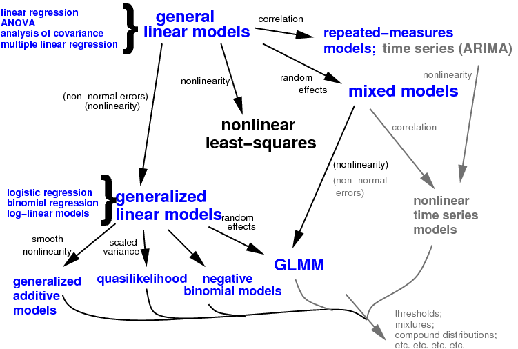

```{r cc,fig.width=0.15, echo=FALSE}
knitr::include_graphics("../pix/cc-attrib-nc.png")
```
Licensed under the Creative Commons 
  [attribution-noncommercial license](http://creativecommons.org/licenses/by-nc/3.0/)
Please share & remix noncommercially,
mentioning its origin.


```{r opts,echo=FALSE,message=FALSE}
library(knitr)
opts_chunk$set(tidy=FALSE,fig.width=6,fig.height=4,fig.position="center",
               dev="tikz")
knit_hooks$set(basefig=function(before, options, envir) {
                   if (before) {
                       par(bty="l",las=1)
                   } else { }
           })
```

```{r pkgs,echo=FALSE,message=FALSE}
library(ggplot2)
theme_set(theme_bw())
library(fastglm)
library(speedglm)
library(microbenchmark)
```

## Logistics

- contact info, e-mail policies
- textbook
- assignments & grading
- policies: group work, take-home exams, etc.


## Scope

- Topics
	- core:
         - linear models: design matrices, contrasts, etc.
         - core GLMs: binary (logistic/probit), binomial, Poisson regression
         - weird GLMs and further topics: complete separation, overdispersion, Gamma models, non-standard links, use of offsets
		 - more weird GLMs: ordinal, negative binomial, zero-inflated
		 - GL mixed Ms: longitudinal / hierarchical / multilevel models
		 - Bayesian methods
    - "extraneous"
         - data wrangling, visualization, and reproducible research: R, [`ggplot`](https://www.rstudio.com/wp-content/uploads/2015/03/ggplot2-cheatsheet.pdf), [tidyverse](https://www.tidyverse.org/packages), [Rmarkdown](https://rmarkdown.rstudio.com/)
	     - data visualization; graphical approaches to diagnostics and model interpretation
         - best practices/ethics for data analysis
- Procedures
    - data exploration
    - model fitting (estimation)
    - graphical and numerical diagnostics
    - inference  
      (Wald, likelihood, bootstrapping, AIC, ...)
    - verbal and graphical presentation/interpretation of results

## What is a GLM?

- handles any linear model
- *link function* specifies nonlinearity between linear predictor and response
- response distribution from the *exponential family*  
(Gaussian, binomial, Poisson, Gamma, ...)

## Why GLMs?

- robust
- fast
- sensible, flexible statistical models
- "sweet spot" in generality and power

```{r run_fastglm,echo=FALSE,cache=TRUE,message=FALSE}
## example from https://github.com/jaredhuling/fastglm
##devtools::install_github("jaredhuling/fastglm")

set.seed(123)
n.obs  <- 10000
n.vars <- 100
x <- matrix(rnorm(n.obs * n.vars, sd = 3), n.obs, n.vars)
y <- 1 * ( drop(x[,1:25] %*% runif(25, min = -0.1, max = 0.10)) > rnorm(n.obs))
ct <- microbenchmark(
    glm.fit = {gl1 <- glm.fit(x, y, family = binomial())},
    speedglm.eigen  = {sg1 <- speedglm.wfit(y, x, intercept = FALSE,
                                            family = binomial())},
    speedglm.chol   = {sg2 <- speedglm.wfit(y, x, intercept = FALSE, 
                                            family = binomial(), method = "Chol")},
    speedglm.qr     = {sg3 <- speedglm.wfit(y, x, intercept = FALSE,
                                            family = binomial(), method = "qr")},
    fastglm.qr.cpiv = {gf1 <- fastglm(x, y, family = binomial())},
    fastglm.qr      = {gf2 <- fastglm(x, y, family = binomial(), method = 1)},
    fastglm.LLT     = {gf3 <- fastglm(x, y, family = binomial(), method = 2)},
    fastglm.LDLT    = {gf4 <- fastglm(x, y, family = binomial(), method = 3)},
    times = 25L
)
```

```{r plot_fastglm,echo=FALSE,message=FALSE}
ggplot(ct,aes(x=expr,y=time/1e6))+geom_violin(fill="gray")+coord_flip()+
    scale_y_log10()+
    stat_summary(fun.y = median, geom = 'point', size = 2)+
    labs(x="",y="time (ms)",title="computation times for 10000 obs/100 vars/binomial model")
```



## Example

Using data on AIDS diagnoses from Australia (Dobson and Barnett p. 69).
Read in data and inspect it:
```{r getdat,echo=FALSE,message=FALSE}
if (!file.exists("../data/aids.csv")) {
    aids <- readxl::read_excel("../data/DB/Table_4.5_AIDS_cases.xls",skip=1)
    write.csv(aids,file="../data/aids.csv",row.names=FALSE)
}
```

```{r aids1,results="hide",message=FALSE}
aids <- read.csv("../data/aids.csv")
head(aids)         ## beginning of data
summary(aids)      ## min/mean/max etc.
skimr::skim(aids)  ## fancier
## construct useful date/index variables
aids <- transform(aids,
                  date=year+(quarter-1)/4,
                  index=seq(nrow(aids)))
``` 

Some basic pictures: base graphics
```{r pix1,basefig=""}
with(aids,plot(date,cases))
```

or with `ggplot2`
```{r pix2}
library(ggplot2)
theme_set(theme_bw())  ## get rid of grey background
 ## simple X/Y scatterplot
p0 <- (ggplot(aids,aes(x=date,y=cases)) 
    + geom_point()     ## add points
)
print(p0)
``` 

Now pictures with nonparametric and GLM fits superimposed:
```{r ggfits1,warning=FALSE,message=FALSE}
(p0
    + geom_smooth()  ## nonparametric
    +  geom_smooth(method="glm",   
                   method.args=list(family=poisson),
                   colour="red") ## GLM fit
)
``` 

Fit a model using `glm()`:

```{r fit1}
g1 <- glm(cases~date, data=aids, family=poisson)
``` 

Diagnostic plots:
```{r diag1,basefig=""}
## set 2x2 grid of plots, tweak margins, label orientation
op <- par(mfrow=c(2,2),mar=c(3,3,2,2),
          las=1,bty="l") 
plot(g1)  ## plot standard diagnostics
par(op)  ## restore parameter settings
```

Check for temporal autocorrelation:
```{r acfplot1,basefig=""}
acf(residuals(g1))
``` 

We have some problems. Will a quadratic fit help?
```{r quadfit}
## poly(.,2) sets up a degree-2 (quadratic) polynomial
g2 <- glm(cases~poly(date,2),aids,family=poisson)
summary(g2)  ## quadratic term significantly negative
```

A picture of the same model fit:
```{r quadfitplot,}
(p0
    +geom_smooth(method="glm",
                 formula=y~poly(x,2),
                 method.args=list(family=poisson))
)
```

Looks like the diagnostics and autocorrelation are better now \ldots
```{r quadfitACF,echo=FALSE,basefig=""}
acf(residuals(g2))
``` 

```{r diag2}
op <- par(mfrow=c(2,2),mar=c(3,3,2,2),
          las=1,bty="l")  ## tweak params as before
plot(g2)
par(op)  ## restore parameter settings
```

\subsection{Power-law model}

Despite stating that "[i]n the early phase of the epidemic, 
the numbers of cases seemed to be increasing exponentially",
@dobson_introduction_2008
suggest fitting a power-law model of 
the form $Y \sim \text{Poisson}(\lambda=t^\theta)$ to the data instead:
```{r pow1}
g3 <- glm(cases~log(index),data=aids,family=poisson)
```

This fits pretty well, in fact much better than even the
Gaussian (quadratic-exponential) model (not shown \ldots).
```{r coefs1,echo=FALSE}
printCoefmat(coef(summary(g3)),digits=3)
cc <- suppressMessages(confint(g3,quiet=TRUE))
``` 

- The intercept is near 1; did we already know that 1984
was the origination year of AIDS in Australia (in which case
AIDS(1)=1)?
- The power law model is $\text{AIDS}(t) \propto t^{`r round(coef(g3)[2],2)`}$, with 95\% confidence intervals on the exponent of 
$\{`r round(cc[2,1],2)`,`r round(cc[2,2],2)`\}$ --- what
does that mean biologically/epidemiologically?

<!-- There are even more models we could try: -->

```{r allmodels,echo=FALSE,eval=FALSE}
tmpfun <- function(...,name) {
    pframe <- data.frame(date=seq(min(aids$date),max(aids$date),length=51))
    if (is.list(list(...)[[1]])) newmod <- do.call(update,c(list(g1),...))
    else newmod <- update(g1,...)
    data.frame(method=name,
               transform(pframe,
                cases=predict(newmod,newdata=pframe,type="response")))
}
library(splines)
mList <- list(.~date,
              .~poly(date,2),
              .~log((date-1984)*4+1),
              list(family=poisson(link="identity")),
              .~ns(date,4))
allmods <- do.call(rbind,mapply(tmpfun,
       mList,
       name=list("exp","Gaussian","power-law","linear","spline"),
       SIMPLIFY=FALSE))
p0 + geom_line(data=allmods,aes(colour=method))
```
<!-- (confidence intervals suppressed for clarity). -->

This turns out, like almost every problem, to be interesting and
a bit challenging when you look at it carefully (see 
[Andrew Gelman on "god is in every leaf of every tree"](http://andrewgelman.com/2005/10/06/god_is_in_every/) - but also consider Tukey ["Far better an approximate answer to the *right* question, which is often vague, than an *exact* answer to the wrong question, which can always be made precise"](http://en.wikiquote.org/wiki/John_Tukey) or
Grenfell ["don't overegg the pudding"](http://idioms.thefreedictionary.com/over-egg+the+pudding)

## References

```{r moremodels,echo=FALSE,message=FALSE,warning=FALSE,eval=FALSE}
library(bbmle)
library(MASS)
g1P <- update(g1,family=poisson)
g1L <- update(g1,family=poisson(link="identity"))
g2P <- update(g2,family=poisson)
g1NB <- glm.nb(cases~date,data=aids,control=glm.control(maxit=1000))
g2NB <- glm.nb(cases~poly(date,2),
               data=aids,control=glm.control(maxit=1000))
g3NB <- glm.nb(cases~log(index),
               data=aids,control=glm.control(maxit=1000))
AICctab(g1NB,g2NB,g3NB,nobs=nrow(aids))
```


