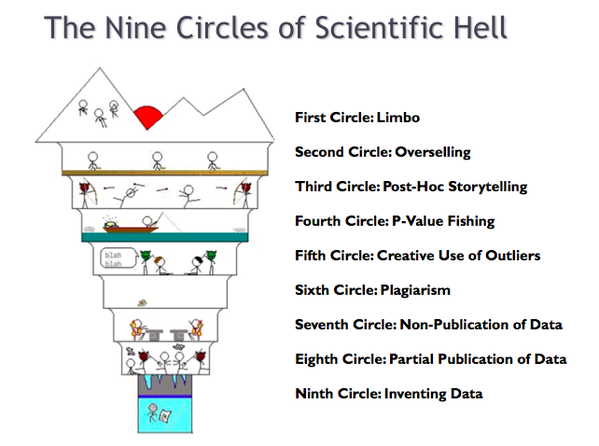

<!-- https://stackoverflow.com/questions/51020181/r-markdown-hide-spoiler-text-hover-over-text-element -->

```{css, echo=FALSE}
.spoiler {
  visibility: hidden;
}

.spoiler::before {
  visibility: visible;
  content: "Spoiler alert! Hover to see the answer."
}

.spoiler:hover {
  visibility: visible;
}

.spoiler:hover::before {
  display: none;
}
```

```{r pkgs,echo=FALSE,message=FALSE}
library(ggplot2); theme_set(theme_bw())
```

# Philosophy

## What do we mean by statistical inference?

answering **scientific questions**

- clear, well-posed questions (theory) >
     - good experimental design >
          - statistical practice
	 
... all are necessary, all connected!

- statistics is for:
    - quantifying best guesses (point estimates)
	- quantifying uncertainty (confidence intervals)
	- statements about *clarity* (statistical significance testing)

## reproducibility crisis

many scientific results are unreproducible

- lack of openness (data/methods)
- questionable research practices (QRPs)
- p-hacking; snooping [@simmons_false-positive_2011]; "Texas sharpshooter fallacy"
- "garden of forking paths" (Gelman)


**analytic decisions must be made independently of the data**

pre-registration (formal or informal);  
at least recognize the line between confirmatory and exploratory analyses

## scientific hell



## power analysis

- experimental design: **before** you observe/experiment
- think about *biological* effect sizes: what is the *smallest* effect that would be biologically interesting?
- need to specify effects and variances (standard deviations)
- simple designs (t-test, ANOVA, etc.)
     - base R: `apropos("power")`
     - [Russ Lenth home page](http://homepage.stat.uiowa.edu/~rlenth/Power/oldversion.html)
- most power analyses are crude/order-of-magnitude
- simulation-based power analysis (@Bolker2008 ch. 5)

## goals of analysis [@harrell_regression_2001]

Harrell ch. 4 on [SpringerLink](https://link.springer.com/content/pdf/10.1007%2F978-3-319-19425-7_4.pdf) (McMaster network)

- exploration
- prediction
- inference

## exploration

- looking for patterns *only*
- no p-values at all
- confidence intervals (perhaps),  
but taken with an inferential grain of salt

## prediction

- want quantitative answers about specific cases
- consider algorithmic approaches (esp. for big data)
- penalized approaches:  
automatically reduce model complexity
- confidence intervals are hard

## inference

most typical scientific goal

*qualitative* statements about clarity and importance of effects:

- effects that are distinguishable from null hypothesis of noise
- test among discrete hypotheses

*quantitative* statements:

- relative strength/magnitude of effects
- importance (e.g. fraction variance explained)

## what do p-values really mean?

- something about "strength of evidence"
- **not** "evidence for no effect" or "no difference"
- null hypotheses in ecology are never (?) true
- "the difference between significant and non-significant is not significant" [@gelman_difference_2006]
- try talking about statistical **clarity** instead

## p-value example

```{r pvals,echo=FALSE}
dd <- data.frame(ttt=LETTERS[1:4],y=c(1,1,5,5),bar=c(0.6,1.5,0.6*5,1.5*5))
dd <- transform(dd,pvalue=2*pnorm(y,sd=bar/1.96,lower.tail=FALSE))
cc <- as.matrix(dd[,"pvalue"])
dimnames(cc) <- list(dd$ttt,"p value")
printCoefmat(cc,P.values=TRUE,has.Pvalue=TRUE,cs.ind=numeric(0),
             tst.ind=numeric(0),digits=3)

```{r pvalplot,echo=FALSE}
ggplot(dd,aes(ttt,y))+
    geom_pointrange(aes(ymin=y-bar,ymax=y+bar))+
    geom_hline(yintercept=0,lty=2)+
    scale_y_continuous(breaks=numeric(0))+
    labs(x="condition",y="estimate")+
    theme_classic()
```

## Real example [@dushoff_mortality_2006]

From a study of influenza mortality, estimating fraction of
mortality attributable to influenza A, influenza B, or
weather alone ...

```{r ci1,echo=FALSE,results="hide"}
source("../R/ciplots.R")
means=c(50, 19, 12)
Pvals=c(0.018, 0.038, 0.882)
xtags = c('Flu A', 'Flu B', 'Weather')
ylab = 'Attributable Deaths (per 10,000)'
pcplot(
        cx=1.2,
	means=means,
	Pvals=Pvals,
	xtags = xtags,
	ylab = ylab,
	showConf=FALSE
)
```

Why does weather not seem to have an effect???

## the explanation

<p class="spoiler">
```{r ci2,echo=FALSE,results="hide"}
pcplot(
    cx=1.2,
    means=means,
    Pvals=Pvals,
    xtags = xtags,
    ylab = ylab,
    showConf=TRUE
)
```
</p>

# realism in data analysis

## how much data do you need for a given model?

- rule of thumb: 10-20 per data point
- rules for continuous, count, binomial data
- counting data points/"degrees of freedom" for clustered data?

## dimension reduction

- must be *a priori*
- discard interactions
- simplify questions
- collapse variables, e.g. by PCA

## References
